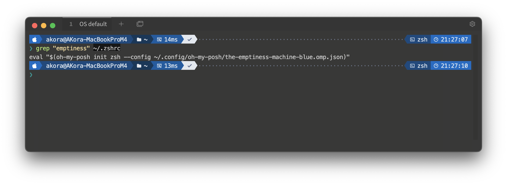

# The Emptiness Machine Theme Collection for Oh My Posh

A collection of carefully crafted Oh My Posh themes featuring clean, modern designs with various color schemes. These themes provide informative prompt segments while maintaining a sleek and professional appearance.

## Screenshots

### The Emptiness Machine (Original)


## Features

- Clean and modern powerline-style prompt
- Informative segments showing:
  - OS indicator with WSL detection
  - Username and hostname
  - Current directory
  - Git status with detailed information
  - Command execution time
  - Exit status indicator
- Multiple color variations to match your terminal theme

## Available Themes

### The Emptiness Machine (Original)


The original theme with balanced colors.

**File:** `the-emptiness-machine.omp.json`

### Blue Variation



Classic blue variation with professional styling.

**File:** `the-emptiness-machine-blue.omp.json`

### Blue Gradient


Smooth blue gradient design for a modern look.

**File:** `the-emptiness-machine-blue-gradient.omp.json`

### Blue Skies


Light blue variation inspired by clear skies.

**File:** `the-emptiness-machine-blue-skies.omp.json`

### Gray Blue


Professional gray and blue combination.

**File:** `the-emptiness-machine-gray-blue.omp.json`

### Time Focused


Time-focused variation with enhanced time display.

**File:** `the-emptiness-machine-time.omp.json`

## Installation

1. Install Oh My Posh following the [official installation guide](https://ohmyposh.dev/docs/installation)
2. Download your preferred theme file from this repository
3. Copy the theme file to your Oh My Posh themes directory
4. Configure your shell to use the theme:

### For PowerShell

```powershell
oh-my-posh init pwsh --config ~/path/to/the-emptiness-machine.omp.json | Invoke-Expression
```

### For Bash

```bash
eval "$(oh-my-posh init bash --config ~/path/to/the-emptiness-machine.omp.json)"
```

### For Zsh

```zsh
eval "$(oh-my-posh init zsh --config ~/path/to/the-emptiness-machine.omp.json)"
```

## Prompt Segments

The theme includes the following segments:

- OS indicator with WSL detection
- Session information (username@hostname)
- Current directory path
- Git status including:
  - Branch name and status
  - Working directory changes
  - Staging status
  - Stash count
  - Upstream status
- Command execution time
- Exit status indicator

## Customization

Each theme file is a JSON configuration that can be customized to your preferences. The themes follow the [Oh My Posh schema](https://raw.githubusercontent.com/JanDeDobbeleer/oh-my-posh/main/themes/schema.json) and can be modified by editing the JSON file.

## Contributing

Feel free to submit issues, fork the repository, and create pull requests for any improvements.

## License

This project is open source and available under the MIT License.
